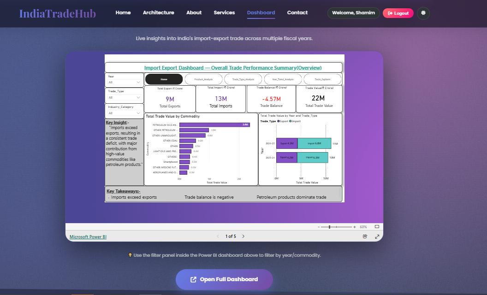

# Import Export Trade Analytics System

Technologies Used:
- HTML
- CSS
- JavaScript
- Python Flask
- MySQL
- Power BI

Features:
- Import Export Trade Analytics Dashboard
- Login and Registration
- MySQL Integration
- Power BI Analytics

 Developed By:
- Shamim Fatima Rayeesahmed Khatib

  # Import Export Trade Analytics System

A modern analytics system developed using Python Flask, MySQL and Power BI to analyze India’s import and export trade data.

## Project Screenshots

### Home Page

### Login Page

### Dashboard

